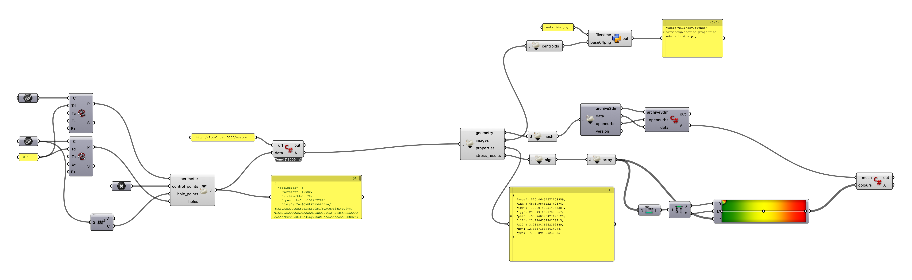

# sectionproperties_WinPython

Experiments with wrapping Robbie van Leeuwen's [section-properties](https://github.com/robbievanleeuwen/section-properties) library in a json API, using [rhino3dm](https://github.com/mcneel/rhino3dm) and [WinPython](https://winpython.github.io/).

The included folder WPy64 contains a standalone python environment downloaded from WinPython.io and populated with the required modules to run section-properties correctly. You should not need python installed on your system.

If you already have python installed and want to run this tool using your local installation then that's totally possible. Check out Robbie's site to explain the modules you will need, then you need to change 1 line of code in the provided grasshopper script. A comment in that script tells you what to do.

